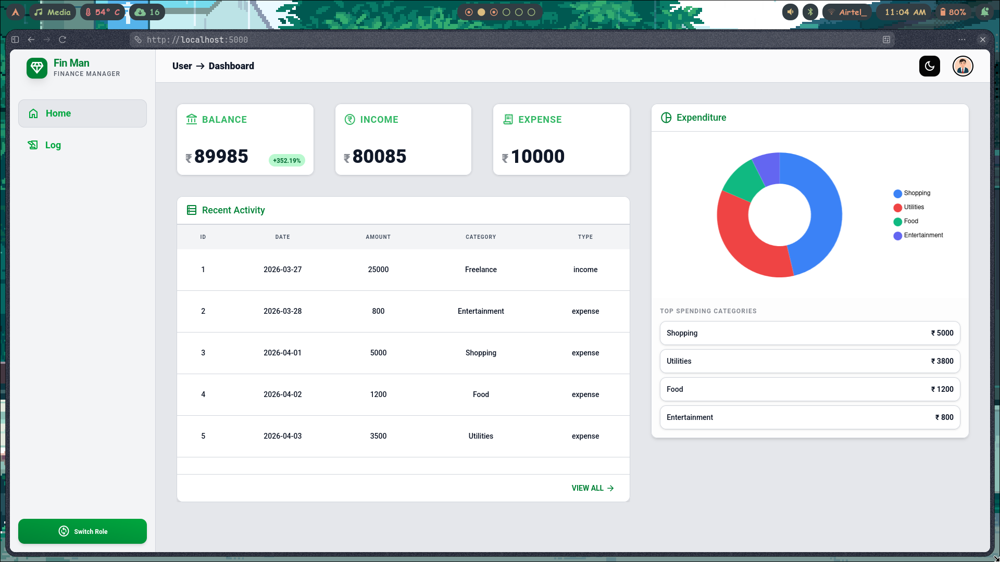
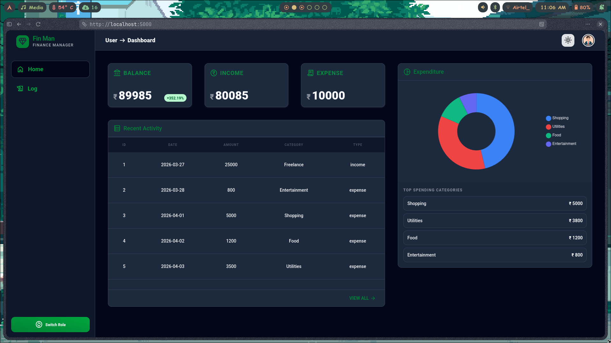

# **Fin Man - Advanced Finance Dashboard**

A high-performance, responsive finance tracking application built with **Python (Flask)** and **Tailwind CSS v4**. This project features a custom-built JSON data management system, simulated Role-Based Access Control (RBAC) using session parameters, and dynamic data visualizations.




You can Check out the webstie right now - [Fin-Man](https://fin-man-2kwy.onrender.com)

_Since the project has been deployed using render you will have to wait for the website to load, this should take anywhere upto 2 minutes._

## **Live Features**
### **1\. Unified Dashboard Overview**

*   **Real-time KPI Cards:** Instant tracking of Total Balance, Income, and Expenses with percentage-based trend indicators.
    
*   **Categorical Breakdown:** An interactive Doughnut chart (Chart.js) that automatically sorts and displays spending by category.
    
*   **Dynamic Data Visualization:** Bar charts for expenditure analytics, synced with the system's dark/light mode.
    

### **2\. Transaction Management**

*   **Live Search & Filter:** Instant JavaScript-based filtering across all transaction records (Date, Category, Amount, or Type).
    
*   **Master Audit Logs (Admin):** High-density table view for administrators to monitor platform-wide activity.
    
*   **CSV Export:** Server-side logic to generate and download transaction history for offline analysis.
    

### **3\. Role-Based UI**

*   **Admin Mode:** Full access to Add Users, Add Transactions, and Delete records.
    
*   **User Mode:** A focused "Read-Only" experience for standard members to track their personal spending patterns.
    
*   **Role Switcher:** A seamless toggle in the sidebar to demonstrate UI behavior changes.
    

### **4\. Advanced UX/UI**

*   **Dark Mode Support:** A persistent theme engine with a glassmorphic sidebar and backdrop-blur headers.
    
*   **Toast Notifications:** Custom-built "Bounce-In" notification system for mode switches and error handling.
    
*   **Mobile Design:** Fully responsive layouts optimized for Android/iOS and Desktop browsers.

## **Technical Stack**

*   **Backend:** Python 3.x, Flask
    
*   **Frontend:** Tailwind CSS v4 (Alpha), Jinja2 Templates, Chart.js
    
*   **Database:** Flat-file JSON (Custom TransactionManager class for CRUD operations)
    
*   **Deployment:** Render (Optimized via Gunicorn)  

## **Setup & Installation**

1.  ```Bash 
    git clone https://github.com/your-username/fin-man-dashboard.gitcd fin-man-dashboard
    ```
    
2.  ```Bash
    pip install -r requirements.txt
    ```
    
3.  ```Bash
    python app.py
    ```

4.  **Access the App:** Open http://localhost:5000 in your browser.

## **Architectural Approach**

### **Data Persistence**

Instead of using static mock data, a TransactionManager class is introduced in data.py. This acts as a lightweight ORM that reads/writes to data/data.json, allowing the dashboard to maintain state across sessions without a heavy SQL setup.

### **State Management**

Application state (Theme Preference, and Role) is managed via **Flask Sessions**, ensuring a consistent user experience during navigation.

For review purposes user_id 2 is harcoded as the default user profile.

### **Theming**

The UI uses a **CSS-Variable-first** approach within Tailwind v4's @theme block. This allows for near-instant theme switching without page reloads or layout shifts.

## **Author**

**Avneesh Yadav** 

This project was built as part of an Internship Assessment.